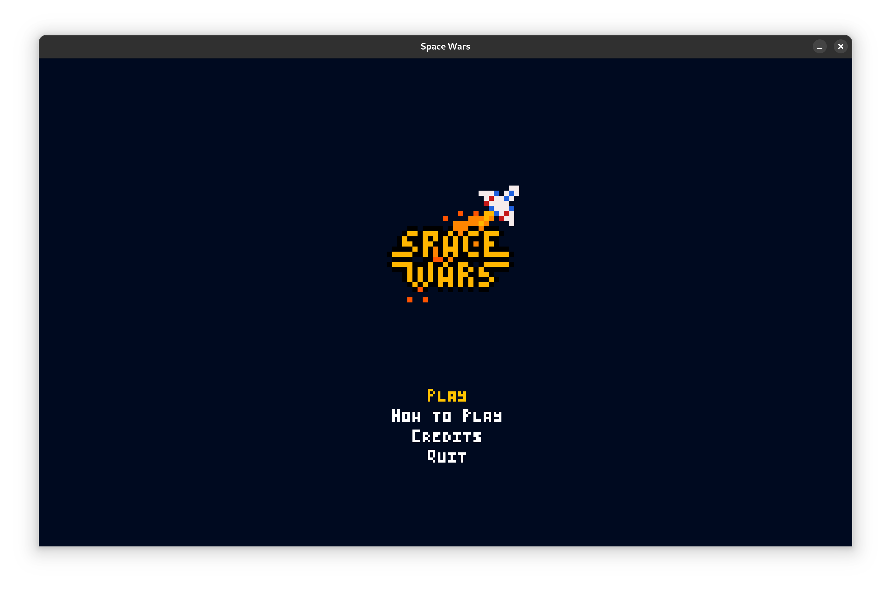
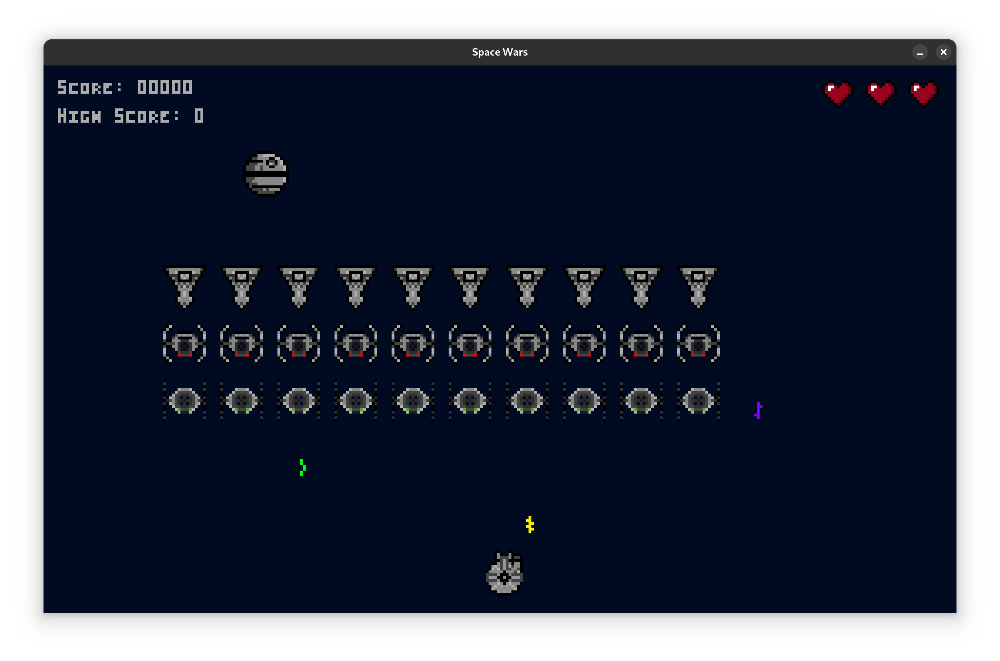
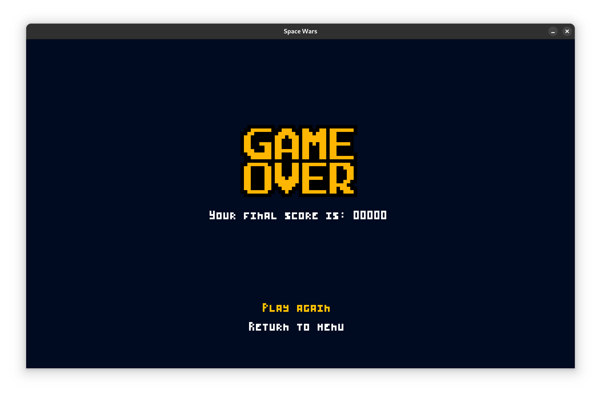
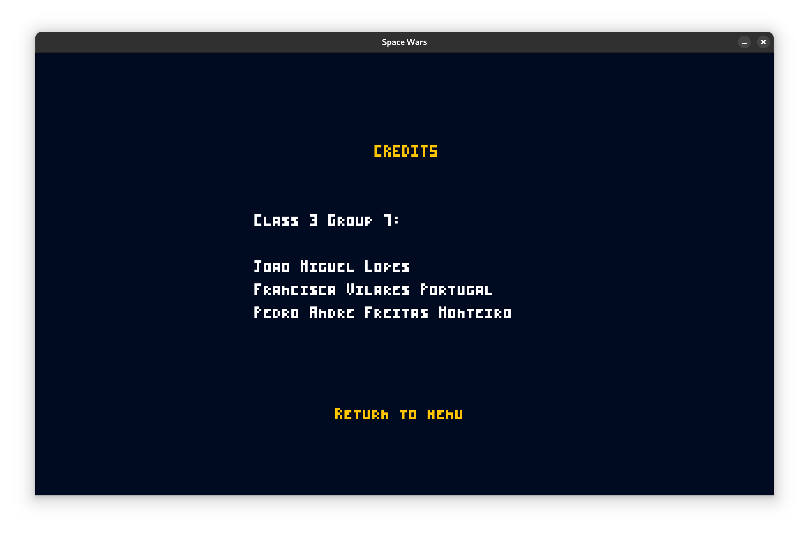

    

# LDTS_T03G07 - SPACE WARS

Space Wars takes you on a nostalgic journey. Test your skills as you dodge enemy fire and strategize to take down waves of relentless spaceships. Try not to die with your 3 lives. Push your limits to achieve a new high score in this highly addictive arcade-style game!

> This project was developed by **Francisca Portugal** (up202303640@edu.fe.up.pt), **João Lopes** (up202307809@edu.fe.up.pt) and **Pedro Monteiro** (up202307242@edu.fe.up.pt) for LDTS 2024/25.

For a more detailed version of this description click [here](./docs/README.md).

## Screenshots

    
    

        <i>Figure 1 - Main Menu</i>
    

    
    

        <i>Figure 2 - How To Play</i>
    

    
    

        <i>Figure 3 - Gameplay</i>
    

    
    

        <i>Figure 4 - Game Over</i>
    

    
    

        <i>Figure 5 - Credits</i>
    

