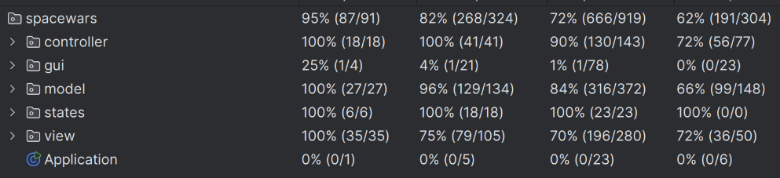

  	

# LDTS_T03G07 - SPACE WARS

Space Wars takes you on a nostalgic journey. Test your skills as you dodge enemy fire and strategize to take down waves of relentless spaceships. Try not to die with your 3 lives. Push your limits to achieve a new high score in this highly addictive arcade-style game!

> This project was developed by **Francisca Portugal** (up202303640@edu.fe.up.pt), **João Lopes** (up202307809@edu.fe.up.pt) and **Pedro Monteiro** (up202307242@edu.fe.up.pt) for LDTS 2024/25.

## Screenshots

    
    

        <i>Figure 1 - Main Menu</i>
    

    
    

        <i>Figure 2 - How To Play</i>
    

    
    

        <i>Figure 3 - Gameplay</i>
    

    
    

        <i>Figure 4 - Game Over</i>
    

    
    

        <i>Figure 5 - Credits</i>
    

## IMPLEMENTED FEATURES

- **States** - We have implemented states for our game, meaning we have more control when adding a new screen to the game and the transitions between them. For example, we have different Menu States and the Game State itself for playing.
- **How To Play** - The app has a screen that teaches new players how to play the game, featuring the controls used and the scoring system.
- **Player Movement** - By clicking the left or right arrow keys, the player is able to move freely throughout the screen boundaries.
- **Player Shooting** - By clicking the space bar, the player is able to shoot a bullet hitting or not the invaders, which is good for increasing their score.
- **Invaders Behavior** - Invaders move across the screen dodging the player's bullets. When they are hit by a bullet, they are killed and only respawn after all invaders are killed. Invaders also shoot bullets to try to kill the player through a random mechanism. Everytime they respawn, their speed is increased, making it harder for the player.
- **Boss Invader** - The boss invader is always on the screen and respawns right after it is killed by the player. When it is killed, a random amount of points is given to the player from a pre-defined list.
- **Lives** - The player has a lives system. They start with 3 lives and they decrease everytime an invader hits them. When it reaches 0 lives, the game finishes and a screen appears showing their final score and if they want to play again or not.
- **High Score** - This game has an high score system. Everytime the player reaches a new high score, it is written in a file in the user's computer, meaning their high score is preserved through app restarts.
- **Image Loader** - This app is able to transform PNG images in pixels and then showing them on the screen. This was made to make the game more visually appealing.

## PLANNED FEATURES

- **Sounds** - Implementing sounds in the game would make a more immersive experience for the player. A background song would fit in the retro style that our game aims for and a sound for each interaction would also be a great improvement over the visual appearance that already exists for that action.
- **Leaderboard System** - Having a leaderboard system would allow the player to challenge their friends in a competitive way. It would show a list of the 10 best high scores with a name associated, so they know which score belongs to who.
- **Power-ups and Debuffs** - This would be an interesting addition by allowing the game to have more types of challenges inside.
	- Our ideas for power-ups are, for example, double points for a certain amount of time, increase their lives if they're running low and freeze the invaders for easier killing.
	- Our ideas for debuffs are, for example, lose half of the player's score, decrease their lives and make the invaders for difficult by increasing their speed or the amount of lives that their bullets take from the player.
- **Asteroids** - This would be another way of increasing the game difficulty by adding another obstacle for the player. As the game is taking place in the space, an asteroid that comes out of nowhere could decrease the player's lives if it hits them.
- **Animations** - To make the game more visually appealing, adding animations for, for example, the invader's and player's death, the decreasing of the lives and bullet's would add the perfect touch for the player's experience.

## DESIGN

### CODE STRUCTURE

**Problem in Context**

The code structure was not well organized, making it hard to understand and maintain. The code was all in the same package, making it hard to find the classes that were related to each other.

**The Pattern**

We have applied the **Model-View-Controller (MVC)** design pattern. This pattern separates the application into three main components: the model, the view, and the controller. The model represents the data, the view represents the user interface, and the controller acts as an intermediary between the model and the view. This pattern was selected because it allows us to separate the application into three main components, making the code structure more organized and easier to understand and maintain.

**Implementation**

The implementation of this design pattern can be found in the model, view, and controller packages in the source code.

**Consequences**

The use of the MVC Pattern in the current design allows the following benefits:
- We can make changes to the application without affecting other parts of the application.
- We can make the application more modular and scalable.

### APPLICATION STATES

**Problem in Context**

The application should know if it is in any type of menu or in the game itself. This could be achieved using a single class with too many if statements to alter its behavior.

This type of implementation is in violation of the **Single Responsibility Principle (SRP).** The SRP states that a class should have only one reason to change, meaning it should only have one job or responsibility. By having a single class handle both the menu states and the game state, we are giving it multiple responsibilities, which makes the code harder to maintain, understand, and extend. Instead, each state should be represented by its own class, adhering to the SRP and making the design cleaner and more modular.

**The Pattern**

We have applied the **State** design pattern. This pattern allows you to represent different states with different subclasses. We can switch to a different state of the application by switching to another implementation. This pattern allowed to address the identified problems because each state has its own subclass, not needing to pass information through other classes for it to transition between screens.

**Implementation**

The implementation of this design pattern can be found in the states package in the source code.

**Consequences**

The use of the State Pattern in the current design allows the following benefits:

- We don’t need to have a long set of conditional if or switch statements associated with the various states; instead, polimorphism is used to activate the right behavior.
- If we wanted to add a new state, it is easy as creating a new subclass, allowing for easy expansion.
- Each state is independent from the others.

### SINGLETON

**Problem in Context**

The game has a high score system that needs to be accessed by multiple classes. This could be achieved by creating a new instance of the high score class every time it is needed, but this would lead to inconsistencies in the high score value.

**The Pattern**

We have applied the **Singleton** design pattern. This pattern ensures that a class has only one instance and provides a global point of access to it. This pattern was selected because it allows us to have a single instance of the high score class that can be accessed by multiple classes.

**Implementation**

The implementation of this design pattern can be found in the highscore package in the source code.

**Consequences**

The use of the Singleton Pattern in the current design allows the following benefits:

- We can control the instantiation of the high score class.
- We can access the high score class from any other class in the game.

### OBSERVER

**Problem in Context**

The game has a respawn system for the invaders. When all invaders are killed by the player, they respawn with a higher speed. This could be achieved by having the player class check if all invaders are dead and then respawn them, but this would lead to a violation of the **Single Responsibility Principle (SRP).** The player class should not be responsible for checking if all invaders are dead and respawning them.

**The Pattern**

We have applied the **Observer** design pattern. This pattern defines a one-to-many dependency between objects so that when one object changes state, all its dependents are notified and updated automatically. This pattern was selected because it allows us to notify all the invaders classes when they need to be respawned.

**Implementation**

The implementation of this design pattern can be found in the RespawnObserver interface in the invaders controller package.

**Consequences**

The use of the Observer Pattern in the current design allows the following benefits:
- We can notify all the invaders classes when they need to be respawned.

### FACTORY METHOD

**Problem in Context**

The game has different types of invaders that need to be created. This could be achieved by creating a new instance of the invader class every time a new invader is needed, but this would lead to a violation of the **Open/Closed Principle (OCP).** The OCP states that a class should be open for extension but closed for modification. By creating a new instance of the invader class every time a new invader is needed, we would need to modify the code every time a new invader is added.

**The Pattern**

We have applied the **Factory Method** design pattern. This pattern defines an interface or an abstract class for creating an object, but lets subclasses alter the type of objects that will be created. This pattern was selected because it allows us to create different types of invaders without modifying the code.

**Implementation**

The implementation of this design pattern can be found in the Invader abstract class in the invaders model package.

**Consequences**

The use of the Factory Method Pattern in the current design allows the following benefits:
- We can create different types of invaders without modifying the code.

### GAME LOOP

**Problem in Context**

The game needs to update the game state and render the game state at a constant rate. This could be achieved by having the game class update the game state and render the game state in the same method, but this would lead to a violation of the **Single Responsibility Principle (SRP).** The SRP states that a class should have only one reason to change, meaning it should only have one job or responsibility. By having the game class update the game state and render the game state in the same method, we are giving it multiple responsibilities, which makes the code harder to maintain, understand, and extend.

**The Pattern**

We have applied the **Game Loop** design pattern. This pattern separates the game state update and game state render into two separate methods. This pattern was selected because it allows us to separate the game state update and game state render into two separate methods, adhering to the SRP and making the design cleaner and more modular.

**Implementation**

The implementation of this design pattern can be found in the while loop in the Application class.

**Consequences**

The use of the Game Loop Pattern in the current design allows the following benefits:
- We can separate the game state update and game state render into two separate methods.
- We can update the game state and render the game state at a constant rate.

### KNOWN CODE SMELLS

> This section should describe 3 to 5 different code smells that you have identified in your current implementation.

## TESTING

- We implemented Unit Testing in conjunction with mockito to try to test the maximum amount of code possible.

**Coverage Report:**

**Pit Test Report:**

## SELF-EVALUATION

> In this section describe how the work regarding the project was divided between the students. In the event that members of the group do not agree on a work distribution, the group should send an email to the teacher explaining the disagreement.

**Example**:

- John Doe: 40%
- Jane Doe: 60%
