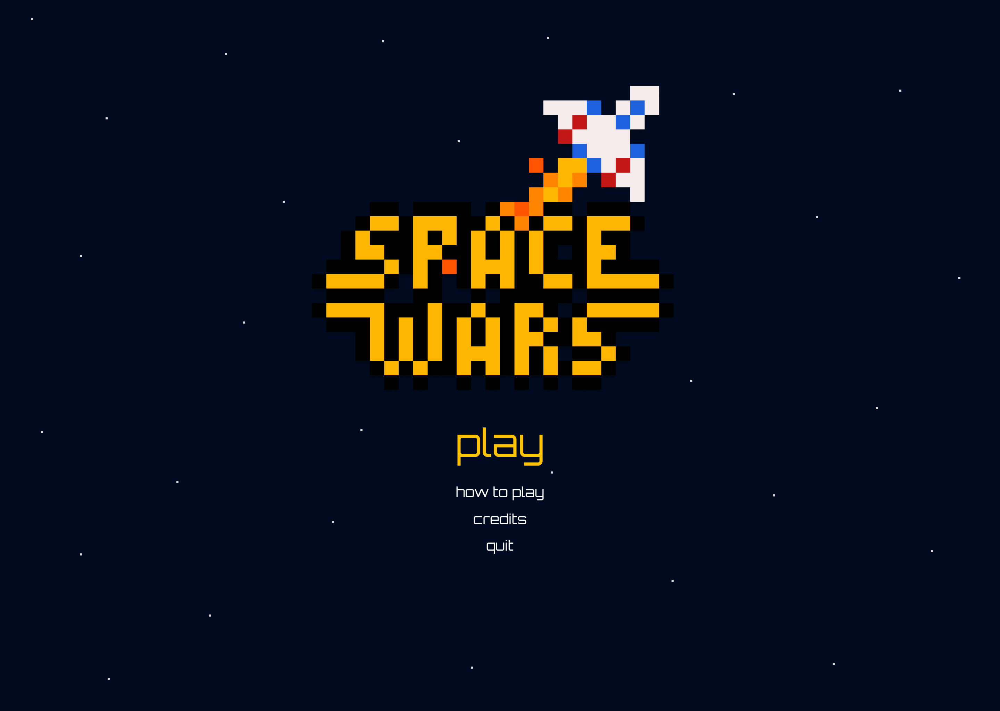
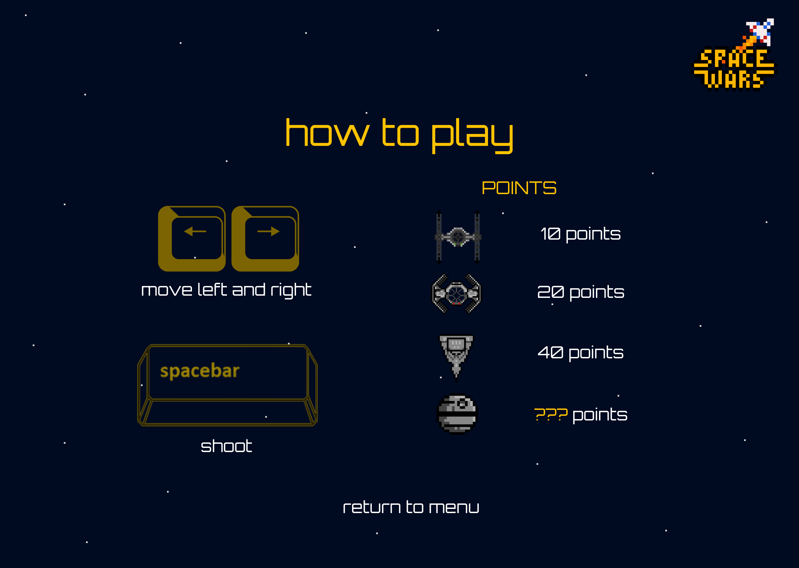
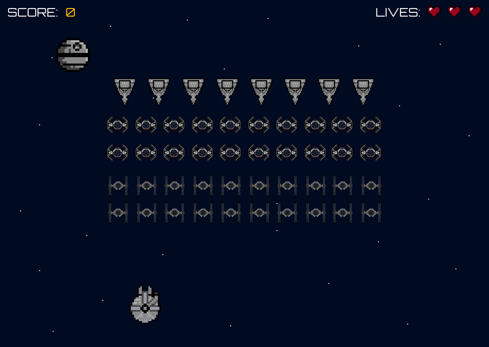
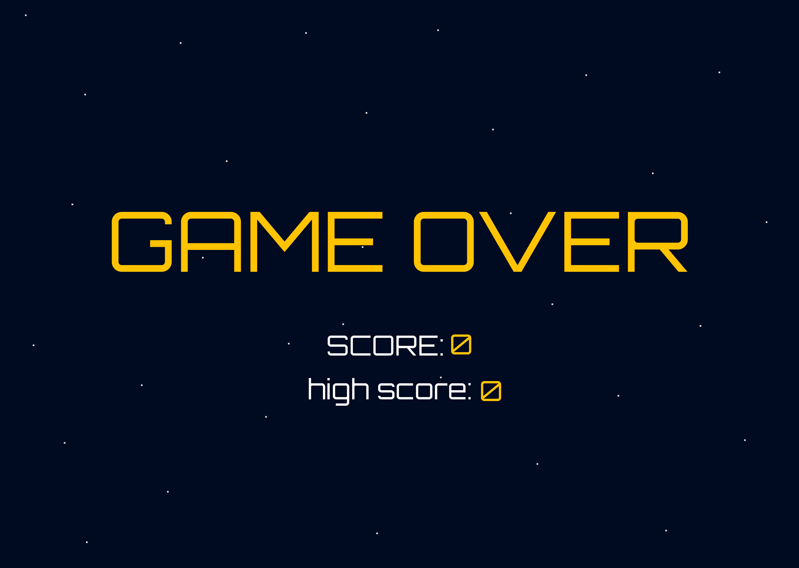
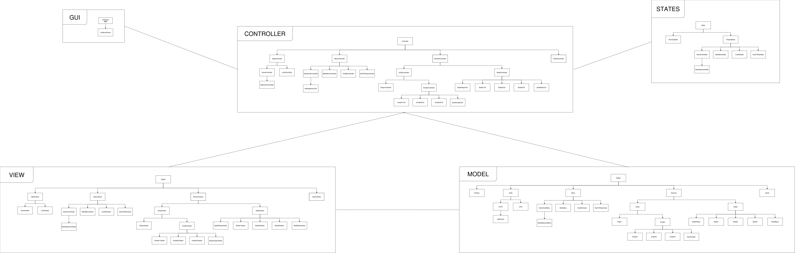

  
  

  <h1 style= "text-align: center;">Space Wars</h1>

  Space Wars takes you on a nostalgic journey. Test your skills as you dodge enemy fire and strategize to take down waves of relentless spaceships. Try not to die with your 3 lives. Push your limits to achieve a new high score in this highly addictive arcade-style game!

  This game was developed as a project for Software Design and Testing Laboratory 2024/2025 at the Faculty of Engineering - University of Porto.

  ## Group Info (T03G07)

  ###  Francisca Portugal
  - Email: [up202303640@edu.fe.up.pt](mailto:up202303640@edu.fe.up.pt)
  - GitHub: 

  ###  João Lopes
  - Email: [up202307809@edu.fe.up.pt](mailto:up202307809@edu.fe.up.pt)
  - GitHub: 

  ###  Pedro Monteiro
  - Email: [up202307242@edu.fe.up.pt](mailto:up202307242@edu.fe.up.pt)
  - GitHub: 

  ## Mockups
  > **Note:** The actual game may differ from the mockups shown below. These mockups are for illustrative purposes only and the final design and features may vary.
  

    
    
<b>Main Menu</b>

    
‎

    
    
<b>How to play</b>

    
‎

    
    
<b>Running game</b>

    
‎

    
    
<b>Game Over</b>

  

  ## Implemented Features
  - **Images:** A way to load images into the game by transforming them into pixels in Lanterna.
  - **Model classes:** Classes for the player, invader, bullet, and game.
  - **Viewer classes:** Classes for the player, invader, bullet, and game.

  ## Planned Features
  - **Main Menu:** An initial screen that lets the user start the game, know how to play the game, view the credits screen and exit the game.
  - **Player and Invader movement:** Making the player move with the arrow keys and the invader move randomly.
  - **Player and Invader shooting:** Making the player shoot bullets with the space key and the invader randomly.
  - **Score system:** When the player kills a type of invader, the score is incremented by a certain quantity of points. An high score will be saved in a separate file.
  - **Lives system:** At the beginning of the game, the player has 3 lives that will be decremented if an invader shoots the player. The game ends when the player rans out of lives.
  - **Credits:** The credits are accessible through the main menu, showing the developers of this game.

  ## UML Diagram
  > Click on the image to view it better
  

    
  

  ## Design

  To keep our code organized and easy to maintain, we're using design patterns. These patterns help us separate different parts of the game and make it easier to add new features.

  ### Implemented Design Patterns
  - **Model-View-Controller (MVC):** We're using MVC to separate the game logic (model), game rendering (view), and game input (controller).
    - Right now, we've got the model and viewer classes done.
  - **Singleton:** We're using Singleton to make sure there's only one instance of the game.

  ### Planned Design Patterns
  - **Factory:** We'll use Factory to create player, invader, and bullet objects.
  - **Observer:** We'll use Observer to notify the game when the player or invader gets hit by a bullet.
  - **State:** We'll use State to define different game states (like running, paused, game over).

  ### Game Loop

  The game loop updates the game state and renders the game. It runs at 60 frames per second to keep things smooth. Even though the game states aren't fully implemented yet, the game loop is working. It tracks the time since the last frame and the number of frames rendered in the current second to monitor performance.

  ## Git Flow

  We used Git Flow to manage our development process efficiently.
  - Feature branches were used to develop new functionalities and merged into the develop branch when ready.
    - We even specified branches for things like README changes and report creation.
  - The main branch is only for project submission and when the game is done.

  GitHub helped us merge branches using Pull Requests, making teamwork easier.

  ## Testing

  - To make sure our game is reliable and works correctly, we wrote a bunch of tests. We used JUnit for unit testing, focusing on the core parts of our model classes like player, invader, and bullet behaviors. 
  - Each test checked if methods worked as expected under different conditions, including edge cases. 
  - We also used mock objects to simulate interactions and isolate the components being tested.
  - We also used pitest for mutation testing to ensure our tests were effective. 
  
  This thorough testing approach helped make our game stable and robust, giving us confidence in its performance and functionality.
